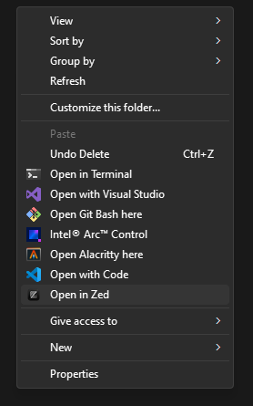

# ZedRC

## Introduction

> This is a simple application to add Zed to your right-click context menu in Windows. Written in Rust.

> :warning: **Must run with administrator privileges**

## How to use
- Clone repo or download the latest release
- If cloned, install the required dependencies using `npm install` and then build the project using `npm run build`
- Run the executable with administrator privileges (if built, in src-tauri/target/release/zedrc.exe)

## Preview

